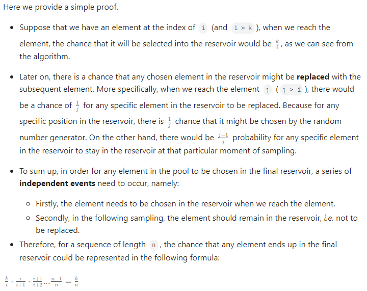

## 382. Linked List Random Node
## Method 1: Extra space
### Algorithm
- First, obtain the length of the given linked list
- Generate a random number based on the length
- Then, return the corresponding position
- We can keep track of a array of values during traversal
- Time complexity: O(n)
- Space complexity: O(n), due to the extra array being used
### Implementation
Python Solution:
```python
class Solution:

    def __init__(self, head: Optional[ListNode]):
        self.head = head
        self.vals = []
        self.length = 0

        while self.head:
            self.length += 1
            self.vals.append(self.head.val)
            self.head = self.head.next
        

    def getRandom(self):
        pos = random.randint(1, self.length) - 1
        return self.vals[pos]

```
C++ Solution:
```cpp
class Solution {
private:
    ListNode* head;
    vector<int> vals;
    int length;
public:
    Solution(ListNode* head) {
        this->head = head;
        this->length = 0;
        while (this->head) {
            ++this->length;
            this->vals.push_back(this->head->val);
            this->head = this->head->next;
        }
    }
    
    int getRandom() {
        int pos = rand() % this->length;
        return vals[pos];
    }
};
```
## Method 2: Reservoir Sampling
### Algorithm
- In order to do random sampling over a population of **unknown size** with constant space, the answer is reservoir sampling
- The reservoir sampling algorithm is intended to sample `k` elements from an population of unknown size. In our case, the `k` happens to be one.
- Initially, we fill up an array of reservoir `R[]` with the heading elements from the pool of samples `S[]`. At the end of the algorithm, the reservoir will contain the final elements we sample from the pool.
- We then iterate through the rest of elements in the pool. For each element, we need to decide if we want to include it in the reservoir or not. If so, we will replace an existing element in reservoir with the current element.
- The proof is given by below:
    
### Implementation
Python Solution:
```python
class Solution:

    def __init__(self, head: Optional[ListNode]):
        self.head = head

    def getRandom(self):
        scope = 1
        res = 0
        cur = self.head

        while cur:
            if random.random() <= 1 / scope:
                res = cur.val
            cur = cur.next
            scope += 1

        return res
```
C++ Solution:
```cpp
class Solution {
private:
    ListNode* head;
public:
    Solution(ListNode* head) {
        this->head = head;
    }
    
    int getRandom() {
        int scope = 1;
        int res = 0;
        ListNode* cur = head;

        while (cur) {
            if (rand() / (float)INT_MAX <= 1.0 / scope) res = cur->val;
            ++scope;
            cur = cur->next;
        }
        
        return res;
    }
};

```